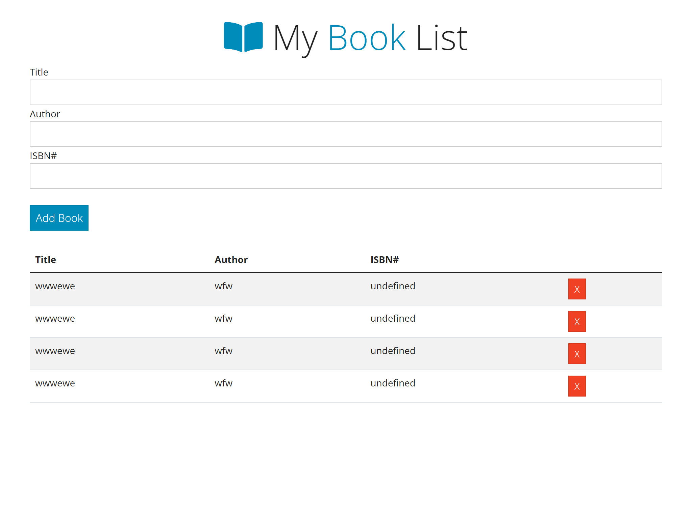

# Javascriopt Book App Practice
# Build a Book List with Javascript. Use classes. Don't use any frame work.

## Description
> A Plain Javascript Book List App

## Built With

- HTML
- BOOTSTRAP - Theme (https://bootswatch.com/yeti/)
- JS

## Live Demo
* [Demo](https://aeon9300.github.io/Javascript_BookList_App/)

## Loom Video Description of Project (5mins)
* [Loom Video](#)

## Procedure to clone project
- open your terminal
- type git clone #
- run the project in your local machine
- Run the project in you browser 
- Inspect it to check the look in mobile format.

## Author

👤 *Adebisi Ayodele Samuel*

- GitHub: [@githubhandle](https://github.com/aeon9300)
- Twitter: [@twitterhandle](https://twitter.com/aeon9300)
- LinkedIn: [LinkedIn](https://www.linkedin.com/in/samuel-adebisi-4a589362/)

## 🤝 Contributing

Contributions, issues, and feature requests are welcome!

Feel free to check the [issues page](../../issues/).

## Show your support

Give a ⭐ if you like this project!

## Acknowledgments
* Template design by [Traversy Media](https://www.youtube.com/watch?v=JaMCxVWtW58)
* Hat tip to anyone whose code was used
* Inspiration
* Travesy Media